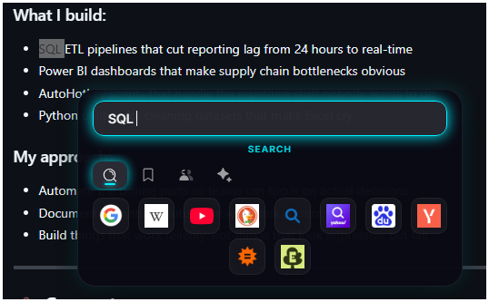
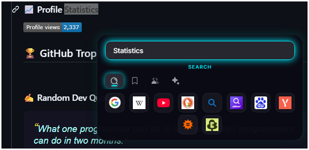
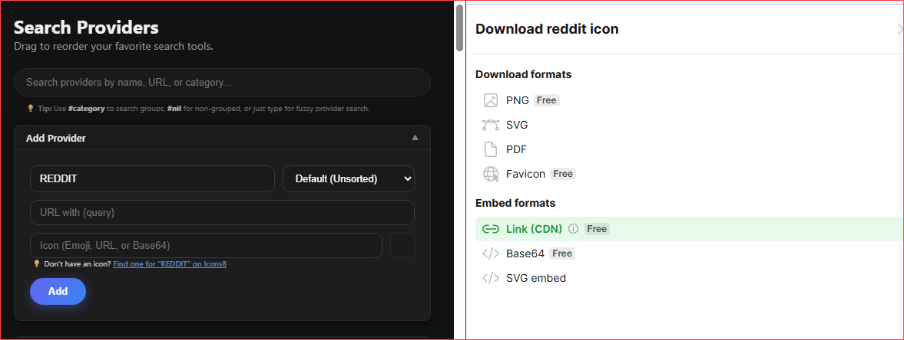
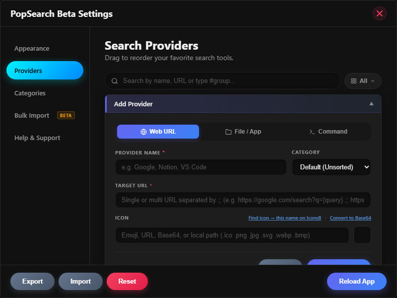
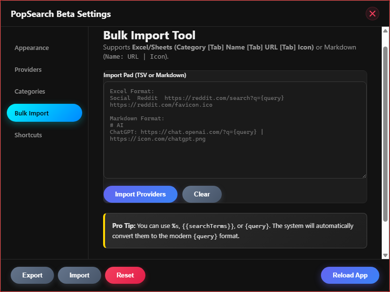

<div align="center">
  
  <h1>PopSearch</h1>
</div>

# 🚀 PopSearch v1.3.0-beta - Instant Search Assistant

[](https://github.com/wsnh2022/pop-search/releases)
[](https://github.com/wsnh2022/pop-search)
[](LICENSE)


PopSearch triggers a customizable search popup from selected text using a global hotkey. Select text in any application, trigger with Right-Click Hold or CapsLock + S, and instantly search across your favorite search engines, AI tools, and bookmarks.

> **Windows 10+ only.** macOS/Linux not supported Currently.

---


### 🆕 New in v1.3.0-beta

| | Feature | Description |
|---|---|---|
| ⌨️ | **Keyboard Navigation** | Arrow keys move between icons, `Tab` switches categories, `Enter` launches, `Escape` closes. Mouse hover stays in sync. |
| 🖥️ | **Script & File Launcher** | Run `.ahk`, `.py`, `.bat` scripts or open any local file/app directly from the popup using the new `File` and `Command` provider types. Smart detection auto-wraps Python and AHK runtimes. |
| 🗂️ | **Category Drag-to-Reorder** | Drag category rows in Settings to rearrange their order. Reflected instantly in the popup tab bar and all dropdowns. |
| 🖼️ | **Local Icon Support** | Paste a local `.ico`, `.png`, `.jpg`, `.svg`, `.webp`, or `.bmp` path into any icon field — auto-converted to portable Base64 on save. |

---
## 🔍 What It Does

### Key Features
- **Search Anywhere**: Select text in any app → trigger popup → search across 40+ engines instantly.
- **Smart Triggers**: Right-Click Hold or CapsLock + S — choose the trigger that fits your workflow.
- **Keyboard Navigation**: Navigate icons with Arrow Keys, switch categories with Tab, launch with Enter.
- **Local Launcher**: Run `.ahk`, `.py`, `.bat` scripts, open local files and apps directly from the popup.
- **Local Icon Support**: Set provider icons from local `.ico`, `.png`, `.jpg`, `.svg`, `.webp`, `.bmp` files.
- **Category Drag-to-Reorder**: Reorganize categories directly in Settings with drag-and-drop.
- **Help & Support**: Integrated troubleshooting guide and one-click access to debug logs in Settings.
- **Default Browser Support**: Search queries and links now respect your system's default browser settings.
- **Infinite Extensibility**: Add any website using `{query}` placeholder and organize into custom groups.
- **Professional Logging**: Managed log rotation (5MB limit) to keep your system clean and optimized.
- **Portable & Private**: Single-file executable (~98 MB), no installation, no telemetry, local auto-save.

---

## 📸 Visual Guide

### The Instant Search Interface


<div align="center">
  <video src="https://github.com/user-attachments/assets/317ba541-bc16-42d7-aaec-0d2484a0c762" controls="controls" style="max-width: 100%; border-radius: 10px;"></video>
</div>

### The Settings Center


<div align="center">
  <video src="https://github.com/user-attachments/assets/aafbf0a8-9f01-4919-9573-3f5073664690" controls="controls" style="max-width: 100%; border-radius: 10px;"></video>
</div>

### Trigger Methods


---

## 📦 Installation

### Requirements
- **OS**: Windows 10 or later (64-bit)
- **Disk Space**: ~98 MB (portable version)
- **RAM**: ~60-80 MB idle
- **Dependencies**: None (portable version)

### Steps
1. Download `PopSearch-1.3.0-beta-portable.exe` from [Releases](https://github.com/wsnh2022/pop-search/releases)
2. Move to desired folder (Desktop, Documents, etc.)
3. Run the application → appears in System Tray

---

## ⚡ Usage

### Trigger Methods

**CapsLock + S**
- Works with or without selected text
- Type directly or search selection

**Right-Click Hold (200ms)**
- Select text, then hold right-click

### Basic Workflow
1. **Select Text**: Highlight text in any application (Browser, PDF, IDE)
2. **Trigger Popup**: CapsLock + S or Right-Click Hold
3. **Navigate Icons**: Arrow keys to move, Tab to switch categories, Enter to launch
4. **Execute Search**: Left-click or Enter on a provider icon to search in default browser

### Popup Keyboard Shortcuts

| Key | Action |
|---|---|
| `→` / `←` | Move right / left through icons |
| `↑` / `↓` | Jump up / down by a full row |
| `Tab` | Next category |
| `Shift+Tab` | Previous category |
| `Enter` | Launch focused icon (or first if none) |
| `Escape` | Close popup |

---

## ⚙️ Configuration

### Adding Search Providers
Under **Providers** tab in settings, add search engines using `{query}` placeholder.
- Example: `https://www.google.com/search?q={query}`

**Custom Icons**: Paste an emoji, HTTP URL, Base64 data URL, or a **local file path** (`.ico`, `.png`, `.jpg`, `.svg`, `.webp`, `.bmp`) into the icon field for a live preview. Local files are automatically converted to portable Base64 on save.





### Bulk Import
Organize bookmarks in Excel with columns: Category, Name, URL (with/without `{query}`), optional icon path. Use **Bulk Import** in Settings to add all at once.



<details>
<summary>💡 Example Custom URLs</summary>

**Maps & Location**
- Google Maps: `https://www.google.com/maps/search/{query}`
- OpenStreetMap: `https://www.openstreetmap.org/search?query={query}`

**Entertainment**
- Spotify: `https://open.spotify.com/search/{query}`
- IMDb: `https://www.imdb.com/find?q={query}`

**Shopping**
- eBay: `https://www.ebay.com/sch/i.html?_nkw={query}`
- Yelp: `https://www.yelp.com/search?find_desc={query}`

**Professional**
- Indeed: `https://www.indeed.com/jobs?q={query}`

**Learning**
- Coursera: `https://www.coursera.org/search?query={query}`
- Udemy: `https://www.udemy.com/courses/search/?q={query}`

</details>

### Appearance Settings
Customize accent colors, icon sizes, grid spacing, transparency. Changes apply in real-time and save automatically.

### Application Control
Right-click tray icon or search bar UI to access Reload/Quit menu.

---

## 🛠️ Development

### Requirements
- Node.js 18.x+
- npm 9.x+
- AutoHotkey v2 (for building trigger engine)

### Build from Source
```bash
git clone https://github.com/wsnh2022/pop-search.git
cd pop-search
npm install

# Build AutoHotkey trigger (.ahk → .exe)
# Compiles .ahk/pop_search_trigger.ahk → assets/pop_search_trigger.exe
npm run build:ahk

# Build Electron application (output: dist/)
npm run build

# Or build both at once
npm run build  # Runs build:ahk then electron-vite build

# Start in development mode (requires AHK binary compiled first)
npm start
```

**Build outputs:**
- `assets/pop_search_trigger.exe` - Compiled AutoHotkey trigger
- `dist/` - Final Electron application (portable version)

### Project Structure
- `src/main`: Main process (window lifecycles, IPC)
- `src/renderer`: Frontend UI (Vanilla JS + CSS)
- `src/preload`: Secure bridge between processes
- `.ahk`: Global hotkey trigger source

---

## 🛑 Troubleshooting

- **Hotkey Conflict**: If `CapsLock + S` conflicts with another app, use Right-Click instead
- **AHK Compilation**: Ensure AutoHotkey v2 is in system PATH
- **Icons Not Loading**: Requires internet connection for remote favicon fetching. For offline use, paste a local file path (`.ico`, `.png`, etc.) directly into the icon field — it will be auto-converted to Base64.

---

## 🔒 Privacy

- **No telemetry, analytics, or network requests** except favicon fetching
- All settings stored locally in `%APPDATA%/PopSearch/config.json` (or portable directory)
- **No data leaves your machine**

---

## 📜 License

MIT License. See [LICENSE](LICENSE) for details.

---

## 📋 Changelog

### v1.3.0-beta — 2026-02-20

#### 🐛 Bug Fixes

| # | Issue | Before | After |
|---|---|---|---|
| 1 | **Local icon (.ico/.png/etc.) not displaying** | Local file paths were only checked for `http`, `data:image`, `./`, `../` prefixes — `.ico` paths were treated as plain text (no `` rendered). Even when detected, `file:///` URLs were blocked by Chromium's cross-origin policy when renderer is served from `http://localhost` (Vite dev). | A 5-file IPC chain (`constants` → `ipcHandlers` → `preload` → `ui.js` → `popup.js`) reads the file in the main process via `fs.readFileSync` and returns a portable `data:mime;base64,...` string. Works in dev + production. Icon input auto-converts to Base64 on paste. |
| 2 | **Long command path breaks provider card layout** | The URL/path `<div>` had no text clamping. Long paths like `C:\Users\...\template.ahk` would wrap freely, pushing Edit/Remove buttons off-screen. | Added `white-space: nowrap; overflow: hidden; text-overflow: ellipsis` to the URL div and `min-width: 0` to the flex parent. Long paths now ellipsis-clip cleanly. |
| 3 | **Quick-select category dropdown clipped/invisible** | Adding `overflow: hidden` to the `.provider-info` flex child (as part of fix #2) silently clipped the `position: absolute` category-change dropdown. | Removed `overflow: hidden` from the flex parent — only the URL `<div>` needs it. Dropdown renders freely again. |
| 4 | **Cancel button missing in Add Provider form** | `#cancelBtn` had `display: none` hardcoded and was only shown when switching to Edit mode — no way to dismiss/reset the form in Add mode. | Removed the initial `display: none`. Cancel is now always visible. Clicking it clears and collapses the form in both Add and Edit modes. |

#### ✨ New Features

| # | Feature | Details |
|---|---|---|
| 5 | **Keyboard Navigation in Popup** | Arrow keys navigate icons (Left/Right within row, Up/Down across rows). Tab/Shift+Tab cycle categories. Enter launches focused icon (falls back to first). Escape closes popup. Mouse hover syncs with keyboard selection index. |
| 6 | **Keyboard shortcut table in Help & Support** | Full keyboard reference visible in Settings → Help & Support. |
| 7 | **Category Drag-to-Reorder in Settings** | Category rows in Settings → Categories are now draggable. Drop target shows accent-color outline. Order is saved immediately and reflected in the popup tab bar and provider dropdowns. |
| 8 | **Local file icon support (all formats)** | `.ico`, `.png`, `.jpg`, `.jpeg`, `.gif`, `.svg`, `.webp`, `.bmp` local paths accepted in icon fields. Auto-converted to portable Base64 data URLs on save. Icon field placeholder updated to list all supported formats. |

---

### v1.2.0-beta — Previous Release

- Initial Settings UI (Providers, Categories, Bulk Import, Appearance, Help)
- Drag-to-reorder for providers
- Quick-select category pill per provider card
- Local file/script launcher support (`file`, `cmd` provider types)
- Bulk import from TSV (Excel copy-paste) and Markdown formats
- System tray integration with context menu
- Export / Import JSON config

---

*For future development plans, see the [Roadmap](ROADMAP.md).*
