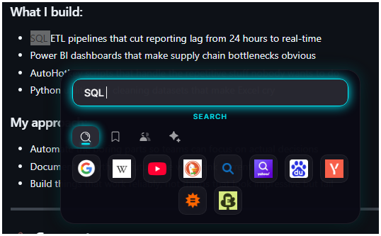
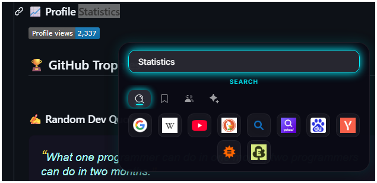
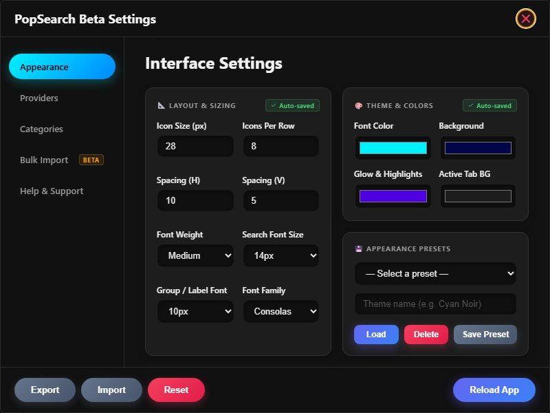
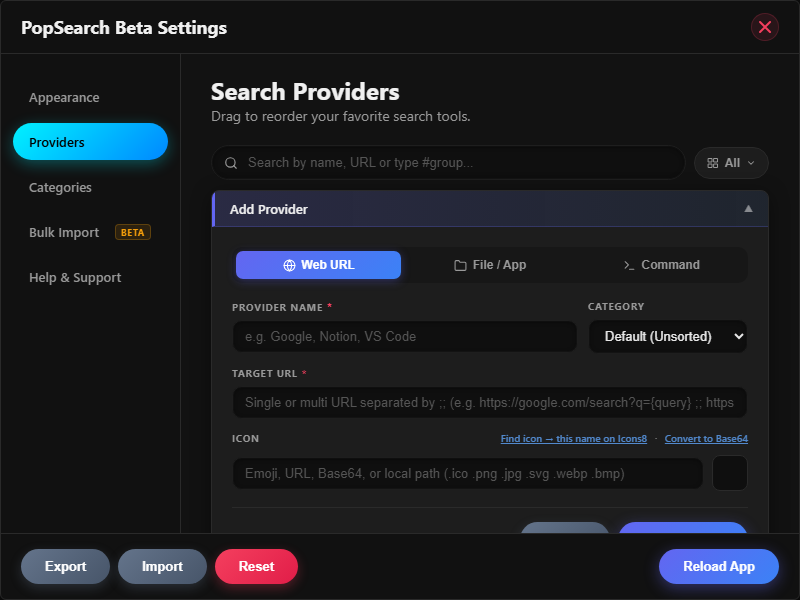
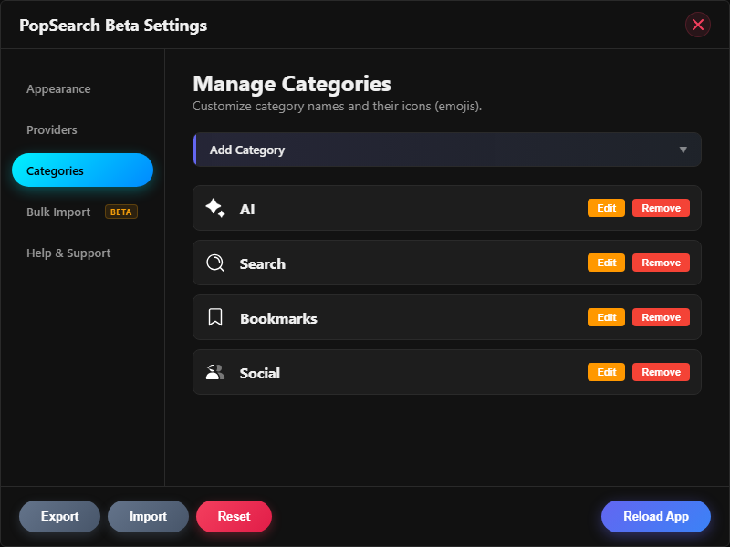
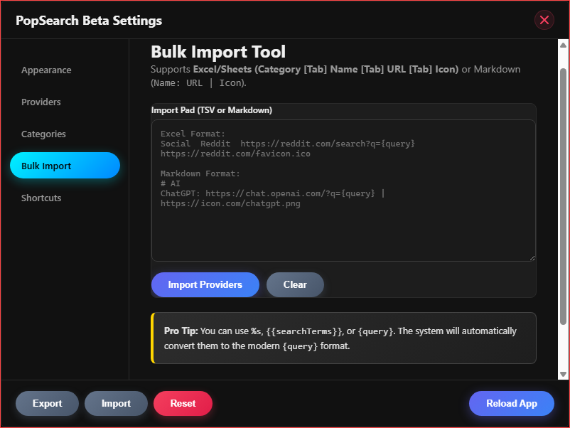

<div align="center">
  
</div>

# Nexus Launcher (Context-Triggered Action Launcher)

[](https://github.com/wsnh2022/nexus-launcher/releases)
[](https://github.com/wsnh2022/nexus-launcher)
[](LICENSE)


Nexus Launcher is a context-triggered action launcher for Windows. Select text in any application, trigger with CapsLock + S, Right-Click Hold (300ms), or scroll the mouse wheel over the popup - and instantly dispatch to any URL-based search engine, AI tool, internal system, local file, or script. Navigate entirely by keyboard or mouse. Providers and categories are both unlimited, with no caps. Runs in the system tray, restores your original clipboard after each search, and ships as a single portable exe with zero telemetry.

> **Windows 10+ only.** macOS/Linux not supported.

---

### New in v1.3.1-beta

| | Feature | Description |
|---|---|---|
| ⌨️ | **Keyboard Navigation** | Arrow keys move between icons, `Tab` switches categories, `Enter` launches, `Escape` closes. Mouse hover stays in sync. |
| 🖥️ | **Script & File Launcher** | Run `.ahk`, `.py`, `.bat` scripts or open any local file/app directly from the popup using the `File` and `Command` provider types. Smart detection auto-wraps Python and AHK runtimes. |
| 🗂️ | **Category Drag-to-Reorder** | Drag category rows in Settings to rearrange their order. Reflected instantly in the popup tab bar and all dropdowns. |
| 🖼️ | **Local Icon Support** | Paste a local `.ico`, `.png`, `.jpg`, `.svg`, `.webp`, or `.bmp` path into any icon field - auto-converted to portable Base64 on save. |
| 🎨 | **Theme Presets** | Save, load, and delete named color theme presets. Instantly swap full color configurations without manual re-entry. |
| 🔗 | **Multi-URL Launch** | Separate URLs with `;;` in a provider's URL field to open multiple tabs simultaneously from a single click or keypress. |
| 🔃 | **Scroll Wheel Category Switching** | Scroll the mouse wheel over the popup to cycle through categories without touching the keyboard. |
| 🔍 | **Provider Search & Group Filter** | Live-search providers by name in Settings. Filter by category via the Group dropdown or `#CategoryName` tag syntax. |
| 🚀 | **Launch at Startup** | Toggle auto-start on Windows boot from Settings → Help & Support or the system tray right-click menu. Creates a shortcut in the Windows Startup folder. Works for both portable and installed builds. |

---

## What It Does

Nexus Launcher sits in the system tray and activates on a global hotkey. The selected text (or typed query) is injected into any provider you configure - a search engine, an AI chat interface, a company intranet, a local script, or a file path. Providers are grouped into categories. Both are unlimited. The popup reflects exactly what you build.

### Key Features

- **Unlimited Providers**: Add any URL using the `{query}` placeholder, any local file path, or any command/script. There is no cap - the library grows as large as you need it.
- **Smart Triggers**: Right-Click Hold (300ms) or CapsLock + S - choose the trigger that fits your workflow.
- **Keyboard Navigation**: Navigate icons with Arrow Keys, switch categories with Tab, launch with Enter.
- **Scroll Wheel Navigation**: Scroll the popup to cycle categories without lifting your hands from the keyboard.
- **Multi-URL Launch**: Open multiple sites from one provider using `;;` URL separator - single click, multiple tabs.
- **Local Launcher**: Run `.ahk`, `.py`, `.bat` scripts, open local files and apps directly from the popup.
- **Theme Presets**: Save and load named full color themes. No re-entering hex values.
- **Local Icon Support**: Set provider icons from local `.ico`, `.png`, `.jpg`, `.svg`, `.webp`, `.bmp` files - auto Base64 converted.
- **Category Drag-to-Reorder**: Reorganize categories in Settings with drag-and-drop. Syncs instantly to popup.
- **Provider Search & Group Filter**: Live-search and category-filter providers inside Settings.
- **Show/Hide Unsorted Toggle**: Control whether providers without a category appear in the popup.
- **Launch at Startup**: Toggle Windows startup shortcut from Settings or the tray right-click menu. Works for portable and installed builds.
- **Default Browser Support**: All URLs open in your system's default browser.
- **Unlimited Categories**: Create as many groups as your workflow requires - by domain, project, client, tool type, or any other scheme. No structural limits.
- **Bulk Import with Dedup**: Import providers from TSV/Markdown. Automatically skips existing name+URL duplicates.
- **Export / Import Config**: Back up and restore the full configuration as a portable JSON file.
- **Professional Logging**: Managed log rotation (5MB limit). One-click access to the log file from Settings.
- **Single Instance**: Only one instance runs at a time. A second launch passes its query or `--settings` flag to the running instance.
- **Portable & Private**: Single-file executable (~98 MB), no installation, no telemetry, local auto-save.

---

## Visual Guide

### The Popup Interface


<div align="center">
  <video src="https://github.com/user-attachments/assets/317ba541-bc16-42d7-aaec-0d2484a0c762" controls="controls" style="max-width: 100%; border-radius: 10px;"></video>
</div>

### The Settings Center


<div align="center">
  <video src="https://github.com/user-attachments/assets/aafbf0a8-9f01-4919-9573-3f5073664690" controls="controls" style="max-width: 100%; border-radius: 10px;"></video>
</div>

### Trigger Methods


---

## Installation

### Requirements

- **OS**: Windows 10 or later (64-bit)
- **Disk Space**: ~98 MB (portable version)
- **RAM**: ~60–80 MB idle
- **Dependencies**: None (portable version)

### Steps

1. Download `NexusLauncher-1.3.1-beta-portable.exe` from [Releases](https://github.com/wsnh2022/nexus-launcher/releases)
2. Move to desired folder (Desktop, Documents, etc.)
3. Run the application → appears in System Tray

---

## Usage

### Trigger Methods

**CapsLock + S**
- Works with or without selected text
- Type directly or search selection
- CapsLock native toggle behavior is preserved when S is not pressed

**Right-Click Hold (300ms)**
- Select text, then hold right-click for 300ms
- Short clicks still behave as normal right-click

### Basic Workflow

1. **Select Text**: Highlight text in any application (Browser, PDF, IDE)
2. **Trigger Popup**: CapsLock + S or Right-Click Hold
3. **Navigate**: Arrow keys to move icons, Tab to switch categories, scroll wheel to cycle categories
4. **Execute Search**: Left-click or Enter to open in default browser

### Popup Keyboard Shortcuts

| Key | Action |
|---|---|
| `Alt+→` / `Alt+←` | Move right / left through icons |
| `Tab` | Next category |
| `Shift+Tab` | Previous category |
| `Enter` | Launch focused icon (or first in category if none focused) |
| `Escape` | Close popup |
| Scroll Wheel | Cycle categories forward / backward |

---

## Configuration

### Provider Types

| Type | Field | Behavior |
|---|---|---|
| `url` (default) | URL with `{query}` placeholder | Opens in default browser |
| `file` | Local file or app path | Opens with `shell.openPath` |
| `cmd` | Script path or shell command | Executes via `child_process.exec`. `.py` and `.ahk` runtimes auto-detected. Supports `{query}` injection. |

### Multi-URL Launch

Separate multiple URLs or paths with `;;` in the URL/path field to open all of them simultaneously from a single icon click or keypress.

```
https://www.google.com/search?q={query};;https://www.bing.com/search?q={query}
```

Both URLs open in separate tabs on a single trigger. Works for `url` and `file` provider types.

### Adding Providers

Under the **Providers** tab in Settings, add any target using the `{query}` placeholder for URL-based providers. This works for any website, internal tool, SaaS platform, or custom domain - there is no supported list. If the site has a search URL, it works.

Example: `https://www.google.com/search?q={query}`

**Custom Icons**: Paste an emoji, HTTP URL, Base64 data URL, or a local file path (`.ico`, `.png`, `.jpg`, `.svg`, `.webp`, `.bmp`) into the icon field for a live preview. Local files are automatically converted to portable Base64 on save.






### Provider Search & Group Filter

The **Providers** tab includes a live search bar. Type to filter providers by name in real time.

Use the **Group** dropdown to filter by category, or type `#CategoryName` directly in the search bar to isolate a specific group. Clear the filter via the × button.

### Bulk Import

Organize providers in a spreadsheet with columns: Category, Name, URL (with/without `{query}`), optional icon path. Paste or type the data into the **Bulk Import** pad in Settings. Existing providers with matching name+URL are automatically skipped. This is the primary method for building large provider libraries - hundreds of entries across dozens of categories can be imported in a single paste.



<details>
<summary>Sample Provider URLs (illustrative - not a supported list)</summary>

Any site with a search URL works. The following are a small sample to illustrate the pattern.

**Maps & Location**
- Google Maps: `https://www.google.com/maps/search/{query}`
- OpenStreetMap: `https://www.openstreetmap.org/search?query={query}`

**Entertainment**
- Spotify: `https://open.spotify.com/search/{query}`
- IMDb: `https://www.imdb.com/find?q={query}`

**Shopping**
- eBay: `https://www.ebay.com/sch/i.html?_nkw={query}`
- Yelp: `https://www.yelp.com/search?find_desc={query}`

**Professional**
- Indeed: `https://www.indeed.com/jobs?q={query}`

**Learning**
- Coursera: `https://www.coursera.org/search?query={query}`
- Udemy: `https://www.udemy.com/courses/search/?q={query}`

</details>

### Appearance Settings

Customize accent colors, background, font, icon sizes, grid spacing. Changes apply in real-time and save automatically.

### Theme Presets

In the Appearance tab, enter a theme name and click **Save Preset** to store the current four color values (font, background, accent, tab active) as a named preset. Select any saved preset from the dropdown and click **Load** to apply it instantly. Delete presets individually via the **Delete** button.

### Show/Hide Unsorted

The **Unsorted** toggle in Settings → Help & Support controls whether providers with no assigned category appear in the popup. When off, only providers with an explicit category are shown.

### Help & Support Panel

Settings → Help & Support contains:

- **Quick Start & Pro Tips** - step-by-step usage reference:
  - Select Text: Highlight text in any app (Notepad, Word, Browser)
  - Trigger: Press Right Click or CapsLock + S to open popup
  - Search: Left-click any icon
  - Manage: Right-click bar for menu
  - History: Original clipboard is restored
- **Keyboard shortcuts table** - all popup and tray hotkeys in one place
- **Show Unsorted toggle** - enable/disable Unsorted providers directly from this panel
- **Open Log File** - one-click button to locate the `debug_log.txt` file on disk

### Export / Import Config

Use **Export** / **Import** buttons in the Settings footer to save or restore the full configuration (providers, categories, appearance) as a portable `nexus_launcher_config.json` file.

### Application Control

Right-click the tray icon or the popup search bar to access Reload / Settings / Quit.

The tray right-click menu also includes a **Launch at Startup** checkbox. Toggling it creates or removes a shortcut in `%APPDATA%\Microsoft\Windows\Start Menu\Programs\Startup`. The same toggle is available in Settings → Help & Support.

---

## Development

### Requirements

- Node.js 18.x+
- npm 9.x+
- AutoHotkey v2 (for building trigger engine)

### Build from Source

```bash
git clone https://github.com/wsnh2022/nexus-launcher.git
cd nexus-launcher
npm install

# Build AutoHotkey trigger (.ahk → .exe)
# Output: assets/nexus_trigger.exe
npm run build:ahk

# Build Electron application (output: dist/)
npm run build

# Start in development mode
npm start
```

**Build outputs:**
- `assets/nexus_trigger.exe` - Compiled AutoHotkey trigger
- `dist/` - Final Electron application (NSIS installer + portable)

### Project Structure

```
src/
  main/
    index.js          - App lifecycle, single-instance lock, startup sequence
    windowManager.js  - BrowserWindow creation, popup screen-clamping logic
    ipcHandlers.js    - All IPC channel handlers (search, config I/O, icon read)
    triggerServer.js  - Internal HTTP server on 127.0.0.1:49152 (AHK → Electron bridge)
    ahkManager.js     - AHK trigger process spawn/kill lifecycle
    trayManager.js    - System tray icon and context menu
    logger.js         - electron-log configuration (5MB rotation)
  renderer/
    popup/            - Popup UI (Vanilla JS + CSS)
    settings/         - Settings UI (store, bridge, ui, main)
  preload/
    index.js          - contextBridge API surface (electronAPI)
  shared/
    constants.js      - IPC channel names, default providers, default appearance
.ahk/
  nexus_trigger.ahk - Global hotkey trigger (CapsLock+S, RButton hold)
```

### Architecture Notes

The AHK trigger communicates with Electron via an internal HTTP server (`triggerServer.js`) on `127.0.0.1:49152`. If the server is not responding (app not yet started), the AHK script falls back to launching `Nexus Launcher.exe --search="<query>"` directly. The main process applies a single-instance lock; a second invocation passes its arguments to the already-running instance.

Hardware acceleration is disabled at startup (`app.disableHardwareAcceleration()`) and the V8 heap is capped at 512MB to keep idle RAM usage minimal.

---

## Troubleshooting

- **Hotkey Conflict**: If `CapsLock + S` conflicts with another app, use Right-Click Hold instead.
- **AHK Compilation**: Ensure AutoHotkey v2 is installed before running `npm run build:ahk`.
- **Icons Not Loading**: Remote favicons require an internet connection. For offline use, paste a local file path (`.ico`, `.png`, etc.) - it will be auto-converted to Base64.
- **Popup Positioning**: The popup automatically clamps to the nearest display's work area. If it appears off-screen, check multi-monitor DPI scaling.
- **Log File**: Open the log directly from Settings → Help & Support → Open Log File.

---

## Privacy

- **No telemetry, analytics, or network requests** except Google favicon fetching (`s2/favicons`)
- All settings stored locally in `%APPDATA%/Nexus Launcher/` (or portable directory)
- **No data leaves your machine**

---

## License

MIT License. See [LICENSE](LICENSE) for details.

---

## Changelog

### v1.3.2-beta - 2026-03-16

#### New Features

| # | Feature | Details |
|---|---|---|
| 1 | **Launch at Startup** | Toggle in Settings → Help & Support and tray right-click menu. Creates/removes a `.lnk` shortcut in the Windows Startup folder. Works for both portable and installed builds via `PORTABLE_EXECUTABLE_FILE` env detection. |

#### Bug Fixes

| # | Issue | Fix |
|---|---|---|
| 1 | Right-click hold not copying selected text to popup | Most apps clear text selection on RButton-down. Fixed by capturing clipboard via `Ctrl+C` at button-down (before `KeyWait`), then using the pre-captured text after the hold timer completes. Short right-clicks still replay as native context menu. |

---

### v1.3.1-beta - 2026-02-20

#### Bug Fixes

| # | Issue | Fix |
|---|---|---|
| 1 | Local icon paths (`.ico`, `.png`, etc.) not displaying | 5-file IPC chain reads file in main process via `fs.readFileSync`, returns portable `data:mime;base64` string. Works in both dev and production. |
| 2 | Long command paths breaking provider card layout | Added `white-space: nowrap; overflow: hidden; text-overflow: ellipsis` to URL `<div>` with `min-width: 0` on flex parent. |
| 3 | Quick-select category dropdown clipped by `overflow: hidden` | Moved overflow clipping to URL `<div>` only; removed it from flex parent to unblock the absolutely-positioned dropdown. |
| 4 | Cancel button missing in Add Provider form | Removed hardcoded `display: none`; Cancel is now always visible in both Add and Edit modes. |
| 5 | Escape key opening "This PC" file manager | Added empty-target guard in `handleAction` so Escape only calls `closePopup()`. |
| 6 | Floating tooltips blocking UI and disrupting typing | Removed all CSS `::after` floating tooltips; replaced with the inline label system below the search bar. |
| 7 | Arrow keys navigating icons while editing text | Arrow keys now navigate icons only at cursor start/end boundary, or when `Alt` is held. Normal text editing is unaffected. |

#### New Features

| # | Feature | Details |
|---|---|---|
| 1 | **Keyboard Navigation** | `Alt+Left/Right` moves between icons. Tab/Shift+Tab cycle categories. Enter launches (falls back to first icon). Escape closes. Mouse hover syncs with keyboard selection. |
| 2 | **Theme Presets** | Save/load/delete named full color presets (font color, bg, accent, tab active bg) from the Appearance tab. |
| 3 | **Multi-URL Launch** | `;;` separator in URL field opens multiple URLs or paths from a single provider action. |
| 4 | **Scroll Wheel Category Switching** | Scrolling the mouse wheel over the popup cycles categories with a 40ms debounce. Supports both vertical and horizontal wheel axes. |
| 5 | **Provider Search & Group Filter** | Live search bar in Settings → Providers. Group dropdown for category isolation. `#CategoryName` tag syntax in the search bar. |
| 6 | **Show/Hide Unsorted Toggle** | Toggle in Help & Support controls whether Unsorted providers appear in the popup tab bar. |
| 7 | **Help & Support Panel** | Quick Start & Pro Tips, full keyboard reference table, Show Unsorted toggle, and one-click Open Log File - all in Settings → Help & Support. |
| 8 | **Inline Icon Label System** | Replaced floating tooltips with a static label row below the search bar. Updates on both hover and keyboard focus. |
| 9 | **Dynamic URL Field Label** | The "Target URL" field label updates to reflect Web URL / Local File / Command based on the type dropdown selection. |
| 10 | **Category Drag-to-Reorder** | Settings → Categories rows are draggable. Order is saved immediately and reflected in the popup tab bar and provider dropdowns. |
| 11 | **Local Icon Support (all formats)** | `.ico`, `.png`, `.jpg`, `.jpeg`, `.gif`, `.svg`, `.webp`, `.bmp` paths accepted in icon fields. Auto-converted to Base64 on save. |

---

### v1.2.0-beta - Previous Release

- Initial Settings UI (Providers, Categories, Bulk Import, Appearance, Help)
- Drag-to-reorder for providers
- Quick-select category pill per provider card
- Local file/script launcher support (`file`, `cmd` provider types)
- Bulk import from TSV (Excel copy-paste) and Markdown formats
- System tray integration with context menu
- Export / Import JSON config

---

*For future development plans, see the [Roadmap](ROADMAP.md).*
